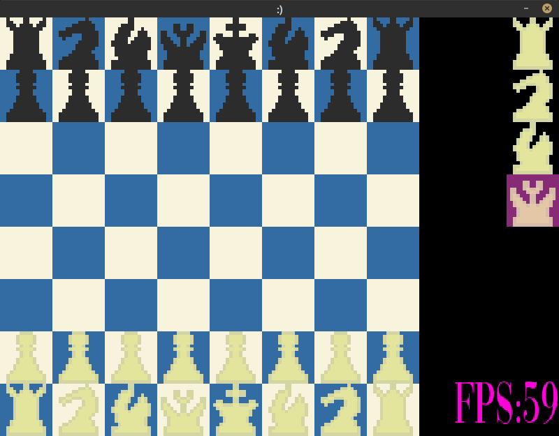

# Smile Chess Engine
- simple and dumb chess engine project
- without lib files
- todo:
    1. Chess:
        - fix and improve move log
        - add castle
        - add en-passant
    2. Engine
        - start implementing minimax
    3. Pretty GUI 
        - change images 

# :)
